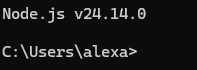

# Web Application Design

## Datos del Proyecto

* **Estudiante:** Alexander de la barrera
* **Matrícula:** AL05073920
* **Carrera:** Desarrollo de Software
* **Semestre:** Octavo
* **Materia:** Web Application Design
* **Profesor:** Ricardo González

---

## ¿Para qué sirve Markdown?

**Markdown** nos sirve para escribir y darle formato a un texto de manera súper rápida, fácil y sin complicaciones. En lugar de estar buscando botones para poner negritas, encabezados o listas como en Word, solo usamos símbolos sencillos (como asteriscos `*` o numerales `#`).

Nos ayuda a:
* **Redactar más rápido:** Escribes el contenido y le das formato al mismo tiempo sin despegar las manos del teclado.
* **Mantener todo ordenado:** Permite estructurar documentos, notas o documentación de código de forma clara y limpia.
* **Usarlo donde sea:** Se lee perfecto en cualquier editor y es el estándar preferido para documentar proyectos en GitHub, blogs y páginas web.

